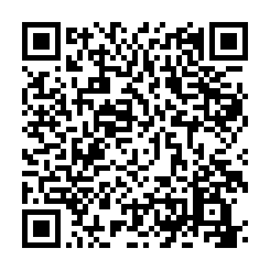

# Nightfall: Ashen Keep

An original gothic action-platformer prototype for a Nintendo 3DS with custom firmware, inspired by the exploration and dual-screen layout of DS-era action RPGs. Original characters, graphics, and castle; no Castlevania assets.

## Install version 1.2.0

Open **FBI > Remote Install > Scan QR Code** on the 3DS:



[Download the CIA](https://raw.githubusercontent.com/CloneDeath/hello-3ds/master/output/hello-3ds.cia?v=1.2.0)

This installs over the original Hello 3DS test using the same title ID, `000400000F7A9100`. The HOME Menu icon is now Nightfall. If the icon remains cached, restart the HOME Menu/console. Development lives on `master`.

## Play

Choose **Enter the Castle**, select one of three empty slots, and name your hunter with the 3DS keyboard. An occupied slot continues from its last save.

| Control | Action |
| --- | --- |
| D-pad / Circle Pad left and right | Move |
| B or A | Jump; hold for more height |
| Y or X | Sword attack |
| D-pad Up | Enter marked door or use sanctuary altar |
| START | Pause menu |
| SELECT | Pause and expand the map |
| Touch lower screen | Select menu items, open map or pause |

Explore six connected rooms: Gatehouse, Ruined Nave, Sanctuary, Ashen Ramparts, Bell Tower, and Warden's Crypt. The lower-screen map tracks visited rooms. Take the door in the Nave to the Sanctuary. Press Up beside its green altar to **save and restore health**. The Bell Tower is an optional side room. Defeat the Warden in the Crypt, then return to the Sanctuary to save the victory.

Skeletons patrol, bats fly, and the Warden periodically charges. Sword hits briefly stun enemies. Defeated enemies drop gold or healing orbs; the Warden awards 25 gold. Taking damage gives brief invulnerability. Death offers a retry from the last save.

The game creates the initial save at the Gatehouse. Later progress is saved **only at the Sanctuary**, not when quitting. Gold, kills, play time, discovered rooms, and the Warden's defeat persist at checkpoints. Ordinary enemies respawn when re-entering rooms. There is no save-slot deletion in this version.

## Save files

Three separate slots live at `sdmc:/3ds/nightfall/slot1.sav` through `slot3.sav`. Each slot has a checksum and a previous-save `.bak`. Writes go through a validated temporary file before replacing the primary save. Copy this folder to back up progress. A failed save is reported on screen.

## Scope and verification

This is the playable foundation: menus, naming, exploration, platforms, melee combat, three enemy types, map, checkpoints, and death/retry. No audio, equipment system, leveling, or full campaign yet.

The CIA compiles with devkitARM; its title ID, version, and content hash are checked. Host tests cover movement, platform landing, doors, combat, pause/map, death, persistence, backup recovery, and separate slots, with address/undefined-behavior sanitizers. The software renderer is checked on the host. This gameplay build has **not yet been tested on physical 3DS hardware**.

## Build

Install devkitPro `3ds-dev`, makerom 0.19.0, and bannertool 1.2.3. Put the latter tools on PATH and set `DEVKITPRO` and `DEVKITARM`:

```sh
make clean
make cia 3dsx
```

Outputs retain the `hello-3ds` filename to keep the install URL stable. This build uses devkitARM GCC 16.1.0 from official `devkitpro/devkitarm` amd64 image manifest `sha256:15b79ce75822c289538d8153da5fa7aafe5e6adc32ad8a575a197beca0f0761b`.

Run portable game tests on a Linux host:

```sh
sh tests/run.sh
```

`source/game.c` owns gameplay and UI state; `world.c` defines the rooms; `save.c` handles persistence; `render.c` draws both screens; `main.c` connects 3DS input, keyboard, timing, and framebuffers.

MIT license. The build Makefile and RSF originated in TricksterGuy/3ds-template (see `LICENSE-template.txt`).
